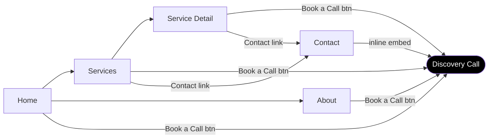

# Wandercode

Portfolio website for **WANDERCODE LIMITED** — Fractional AI Product Strategist services targeting B2B startups.

**Positioning:** RaaS (Results as a Service) — delivering outcomes, not billing hours.

## Tech Stack

- **Framework:** React 18 + TypeScript
- **Build:** Vite with SWC
- **Styling:** Tailwind CSS + shadcn/ui components
- **Routing:** React Router DOM
- **Package Manager:** bun

## Prerequisites

- [bun](https://bun.sh)

## Getting Started

```bash
# Install dependencies
bun install

# Start development server (http://localhost:8080)
bun dev
```

## Scripts

| Command | Description |
|---------|-------------|
| `bun dev` | Development server with hot reload |
| `bun run build` | Production build |
| `bun run preview` | Preview production build locally |
| `bun run lint` | Run ESLint |
| `bun run typecheck` | TypeScript type checking |
| `bun run check` | Run both typecheck + lint |

## Site Flow



## Pages Overview

| Page | Purpose |
|------|---------|
| **Home** | Hero with value prop, services preview, trust signals |
| **Services** | Three offerings: Consultancy, AI Development, Workshops |
| **About** | Background, expertise grid, "Why Fractional?" |
| **Contact** | Cal.com embed, email, LinkedIn, company details |

## Deployment

Hosted on **Vercel** at [wandercode.ltd](https://wandercode.ltd). Every push to `main` triggers a production deployment automatically.

## Company

**WANDERCODE LIMITED**
Hong Kong

## License

MIT — see [LICENSE](./LICENSE).
